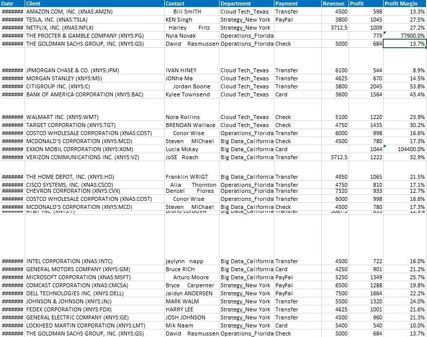
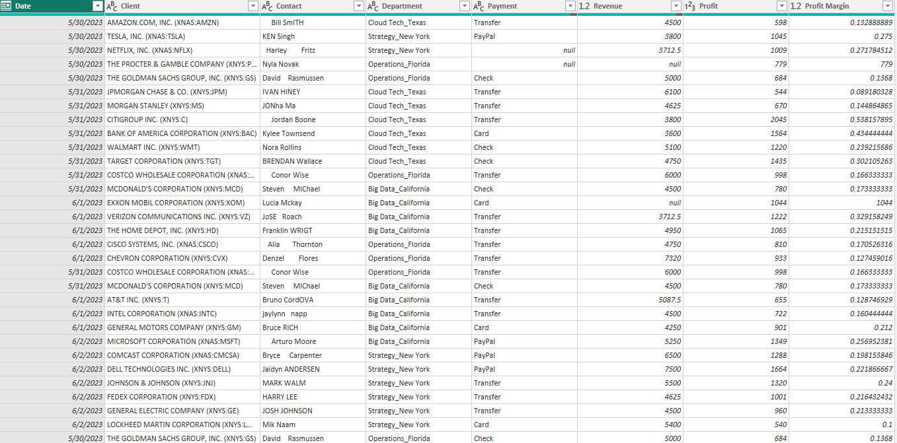
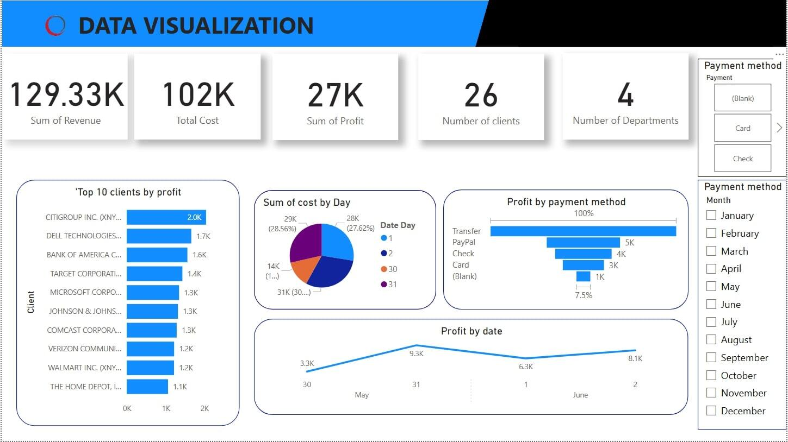

# Zentora-Nexus-Ltd-Analysis.
## INTRODUCTION
This project is focused on analyzing and visualizing business data to provide insights into revenue generation for Zentora Nexus Ltd., a fictional retail and distribution company. The goal was to uncover trends, evaluate performance across different segments, and support data-driven decision-making.

## Problem Statement
Using business data, interactive dashboards and visualizations will be created to answer critical questions such as:

-  Visualize monthly, quarterly, and annual revenue trends.

-  Identify top-performing products and regions.

-  Analyze customer segments contributing most to revenue.

-  Provide actionable insights to boost sales and profitability.
  
  The goal of this project is to analyze Zentora Nexus Ltd. business data to uncover key trends, patterns, and opportunities for revenue growth.

  ## Skills & Expertise Employed/Gained in the Analysis Process
  
-  Data Cleaning & Preparation: Processed raw data by handling missing values, duplicates, and inconsistent entries to ensure accuracy.

-  Data Analysis & Interpretation: Explored revenue patterns, performed comparative analysis across time periods, regions, and products.

-  Data Visualization: Designed clear, interactive charts and dashboards to present insights effectively.

- Business Intelligence Reporting: Translated analytical findings into business-friendly reports to guide strategic decisions.

- Dashboard Design: Built an intuitive dashboard for stakeholders to monitor KPIs like total revenue, sales growth, and customer segments.

- Storytelling with Data: Communicated insights through visuals and concise summaries to engage both technical and non-technical audiences.
  
These skills ensured a thorough and insightful analysis of Zentora Nexus Ltd's revenue performance.

## Data Modelling

 Data in Excel              | Data in Power BI 
:----------------------:        | :----------------------:   
        | 

## My Data Sketch

Sketch on paper                 | Sketch on Powerpoint  
:----------------------:        | :----------------------:   
                 | 

## Dashboard

## Analysis: Key Revenue Insights - Zentora Nexus Ltd.

-  Financial Overview:
Total Revenue: ₦129.33K | Total Cost: ₦102K | Total Profit: ₦27K (≈21% Profit Margin)

-  Top Performing Clients:
Citigroup – Highest profit contributor (₦2K)
Dell Technologies – Next highest (₦1.7K)
Bank of America & Target Corp. – Strong performers (₦1.6K & ₦1.4K)

-  Payment Method Analysis:
Transfers drove the highest profit (₦15K), over 3x higher than other payment methods (card/check).
Citigroup and Costco accounted for 100% of transfer-related revenue.

-  Monthly Peak:
May recorded the highest single-day profit at ₦9.3K on the 31st.

-  Data Gap Identified:
Netflix contributed ₦3.71K, but the payment method was unclassified, indicating a possible tracking or entry issue.

-  Strategic Insight:
Transfer-based clients (Citigroup, Costco) are key profit drivers.

##  Recommendation & Conclusions 
# Key Takeaways:

-  Zentora Nexus Ltd.  should focus on maintaining and strengthening relationships with transfer-based clients like Citigroup and Costco, as they contributed the highest profit through that payment method.

-  Efforts should be made to identify and attract new clients with similar profiles to top performers such as Citigroup, Dell Technologies, and Costco.

-  Underperforming payment methods such as card and check should be evaluated for efficiency improvements or phased out in favor of more profitable methods like transfers.

-  Data entry processes should be improved to ensure proper classification of payment methods and eliminate tracking issues like the one observed with Netflix.

-  Since May recorded the highest revenue (₦9,300), future marketing and sales campaigns should be aligned with similar seasonal trends to maximize impact.

  ##  Final Thought:
This revenue analysis for Zentora Nexus Ltd. revealed that a significant portion of profit was driven by a few key clients using transfer payment methods. Citigroup and Costco were standout contributors, emphasizing the need for focused client engagement. Additionally, the insights highlight the importance of improving data quality and capitalizing on high-performing months. By acting on these recommendations, the company can enhance its profitability, strengthen client relationships, and make better-informed strategic decisions.

